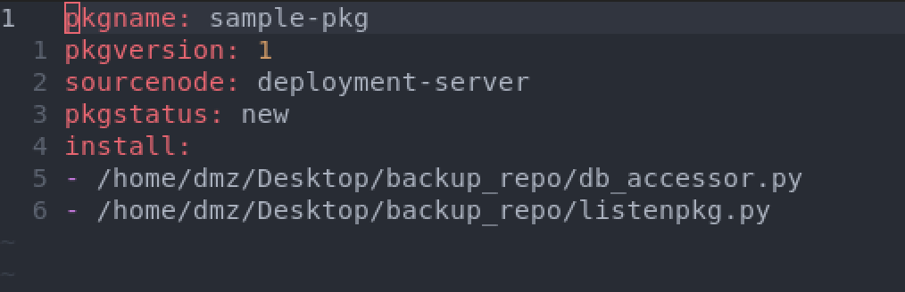
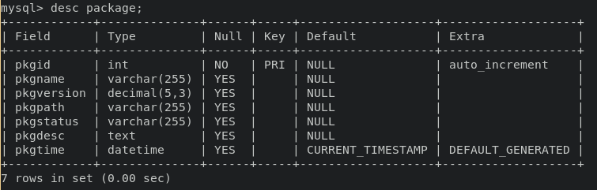

## Started Package Tool

Started on a package tool that can be used to package & send files to deployment server. Current inputs look something like:

To make a package:
> *command-subcommand-pkgname-files*

> package naming convention: name-version

> pack make samplepkg-1.2 api_connect.html api_accessor.py

This makes and sends a tar.gz over scp with the following files:
* pkg.yaml
* api_connect.html
* api_accessor.py

Full paths for files derived from directory traversal. This is assuming from the start each corresponding node (Ex. Frontend) of a given cluster is identical, and any changes to QA and PROD cluster stems from DEV cluster. Sourcenode is derived from the nodes hostname.

Current pkg.yaml:

## Currently: pkg listners/senders and deployment server setup

two versions of listener/sender
* directly using sockets 
* scanning destination directories

Currently using scan destination directory method since it was simpler to get up and running. If sockets are necessary then no problem, just more research is needed with ssh key exchange while interfacing with the incoming scp message on the port. 

Scanning destination directories allows the listener to be removed from the key exchange, however if the outgoing packages from deployment server are automated, there will still be key exchange implementation on the sender script. Time will tell whats easiest / necessary.

Currently making some assumptions about the database schema and yaml format that will be inside package.tar.gz. Everything can be adapted according to how things go and whats needed. Just needed a starting point.

